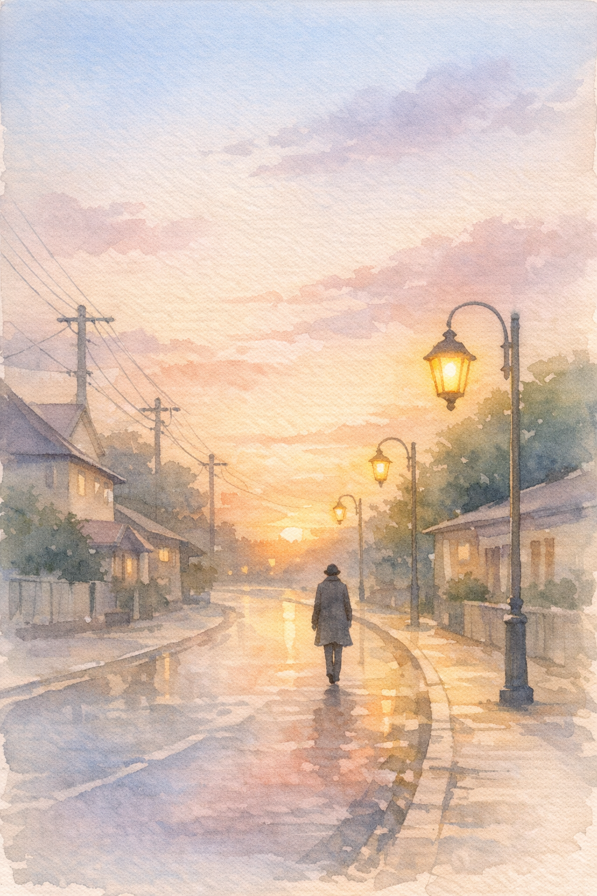

## Prompt A — Painting / Watercolor

**Medium:** Watercolor painting  

**Elements & Principles:** Line, Value, Movement, Texture, Unity  

**Tools:** Soft brushes, water, diluted pigments  

**Technique / Process:** Wet-on-wet, smooth blending, soft gradients  

**Composition / Subject:** A quiet street scene at sunset with one person walking under streetlights  

**Visual Prompt:**  
Create a watercolor painting of a quiet street scene at sunset with one person walking under streetlights. Use soft brushes, water, and light colors to create smooth blending and gentle gradients. The artwork should have soft lines, simple shapes, and a calm atmosphere. Focus on showing movement through the walking figure and unity through the overall composition. The colors should look natural and slightly faded, with a peaceful and quiet mood.

